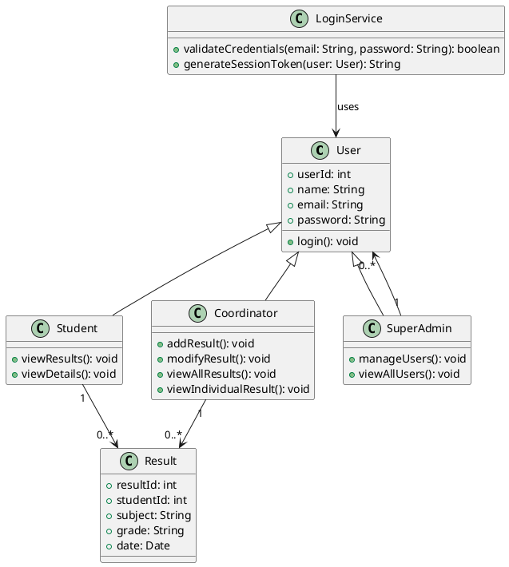

# Student Result Management System

This is a web-based **Student Result Management System** designed to simplify the process of managing and viewing student results. It allows students, coordinators, and super admins to interact with the system based on their roles. 

---

## Features

### **For Students**:
- View individual results.
- View personal details.

### **For Coordinators**:
- Add new results.
- Modify existing results.
- View all results.
- View individual student results.

### **For Super Admins**:
- Manage users (add, edit, or delete).
- View all users.

---

## System Architecture

### **Core Components**:
1. **User**: Base class for all users (Student, Coordinator, SuperAdmin).
2. **Student**: A subclass of `User`, with access to viewing results and personal details.
3. **Coordinator**: A subclass of `User`, with privileges to manage results.
4. **SuperAdmin**: A subclass of `User`, with administrative privileges to manage users.
5. **Result**: Stores details of results, including student ID, subject, grade, and date.
6. **LoginService**: Handles user authentication and session token generation.

### **UML Diagram**:
The relationships between the components are visualized in the following UML class diagram:



---

## Tech Stack
- **Frontend**: HTML, CSS, JavaScript
- **Backend**: Python (Django/Flask) or Node.js
- **Database**: MySQL/PostgreSQL

---

## Installation and Setup
1. **Clone the repository**:
    ```bash
    git clone https://github.com/your-username/student-result-management.git
    ```
2. **Navigate to the project directory**:
    ```bash
    cd student-result-management
    ```
3. **Install dependencies**:
    ```bash
    npm install  # For Node.js
    # OR
    pip install -r requirements.txt  # For Python
    ```
4. **Configure the database**:
    - Update database connection settings in the `.env` or configuration file.
5. **Run the application**:
    ```bash
    npm start  # For Node.js
    # OR
    python manage.py runserver  # For Python
    ```
6. **Access the application**:
    - Open your browser and go to `http://localhost:3000` (or the configured port).

---

## How to Contribute
1. Fork the repository.
2. Create a feature branch:
    ```bash
    git checkout -b feature-name
    ```
3. Commit your changes:
    ```bash
    git commit -m "Add your message here"
    ```
4. Push to the branch:
    ```bash
    git push origin feature-name
    ```
5. Create a pull request.

---

## License
This project is licensed under the MIT License. See the `LICENSE` file for details.

---
## Team Member
- **Arup**
- **Saif**
- **Ador**
---

## Contact
For any questions or suggestions, please reach out to:
- **Email**: arupsaifador@gmail.com
- **Phone**: 019********
- **GitHub**: [your-username](https://github.com/your-username)
